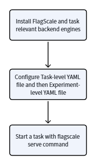

# Workflow

The following diagram briefly demonstrates how to use FlagTree to generate operators.
The following diagram briefly demonstrates how to use FlagScale to run a training, inference, serving, or reinforcement learning task in a general way.

