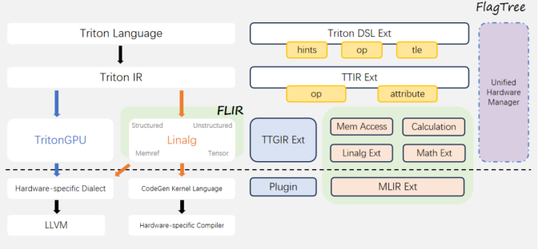

# FLIR: Unified intermediate layer

## Overview

FLIR (FlagTree Linalg Intermediate Representation) is a multi-backend unified intermediate layer that serves as the central hub for lowering Triton extensions intermediate representations (for example, Hints, Ops, and TLE) to hardware-specific dialects. When you use Hints and TLE features, FLIR feature is automatically used without any user intervention.

## Position in the compilation pipeline

The following diagram indicates the
position of the FLIR in the compilation pipeline.

## Core capabilities

| Capability | Description |
|----------|-------------|
| **Language Coverage** | Supports 76 Triton language primitives and 103 operators. |
| **Memory Access** | - Structured Memory Access: Provides a unified lowering path and implementation.   - Unstructured Memory Access: Provides a finite number of lowering paths. |
| **Tensor Calculation** | NPU and DSA backend classified specializations, such as different algorithmic implementations of multivariate reductions. |
| **Hardware Ecosystem Support** | - Fully backend-specialized, such as expanding buffer-assisted synchronization and transmitting hardware-specific information.   - Officially supports AIPU, Huawei Ascend, and Tsingmicro, with standardized backend registration via `third_party/[backend]/backend/compiler.py`. |
