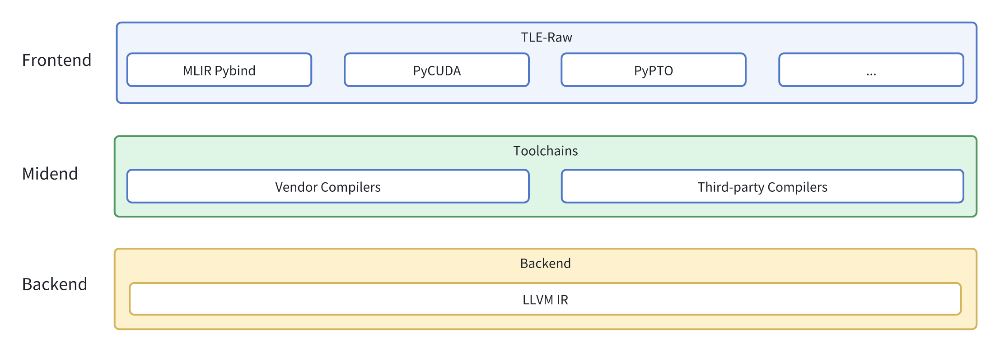

# TLE-Lite, TLE-Struct, and TLE-Raw

TLE-Lite, TLE-Struct, and TLE-Raw are the compiler hint languages, located in the middle layer of the AI ecosystem. The upper layer connects AI frameworks through graph compilers and operator libraries, while the lower layer connects to various hardware runtimes.

The following diagram demonstrates the location of TLE-Lite, TLE-Struct, and TLE-Raw in the AI ecosystem.

These three compiler hint languages provide different levels of performance optimizations for different users:

- TLE-Lite allows users to modify existing Triton kernels with minimal changes, while being compatible with various hardware backends. It can be used by algorithm engineers in quick optimization scenarios.
- TLE-Struct allows users to explicitly defines structural mapping between computation and data for different clusters with different hardware architectures, such as GPGPU and DSA. It can be used by developers who have a certain understanding of characteristics and optimization of targeted hardware.
- TLE-Raw allows users to directly modify vendors' native programming languages. It can be used by developers who have a good understanding of targeted hardware. These developers are mainly the performance optimization experts.

Hints, TLE-Lite and TLE-Struct will eventually lower to LLVM (Low Level Virtual Machine) IR (Intermediate Representation) through FLIR (that is, FlagTree IR), while TLE-Raw will lower to LLVM IR through the corresponding compilation pipeline of the language, such as the vendor's private compiler. Finally, they will be linked together to jointly generate a complete kernel for the runtime to load and execute.

## TLE-Raw

The following diagram illustrates the TLE-Raw's compatibility with existing DSLs (TileLang and cuTile) as well as essential libraries and tools (PyCUDA and MLIR Pybind), and also the location in the AI ecosystem.

For TLE usage information, see [Use TLE-Lite](/user_guide/use-tle-lite.md), [Use TLE-Struct](/user_guide/use-tle-struct.md), and [Use TLE-Raw](/user_guide/use-tle-raw.md).
