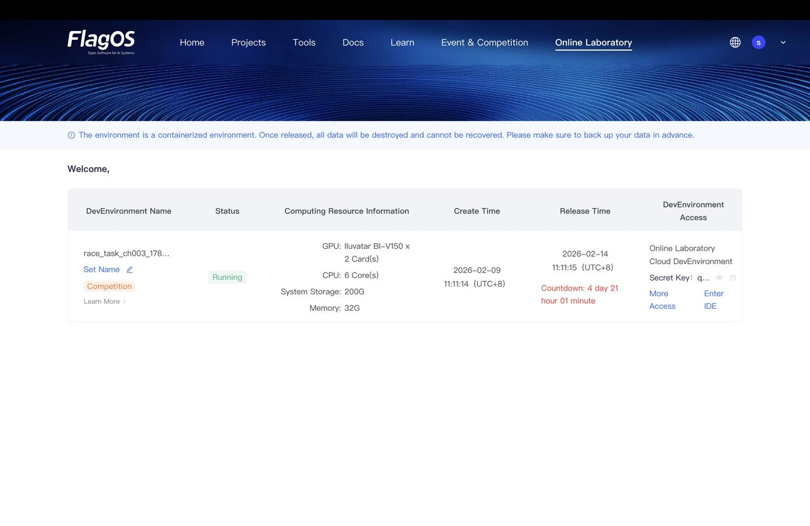
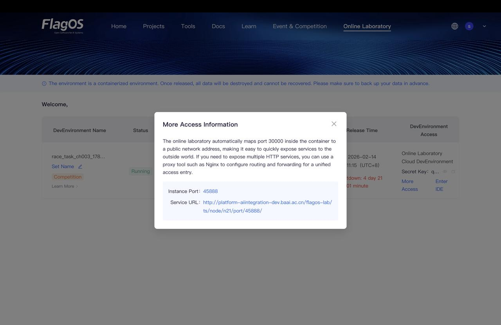
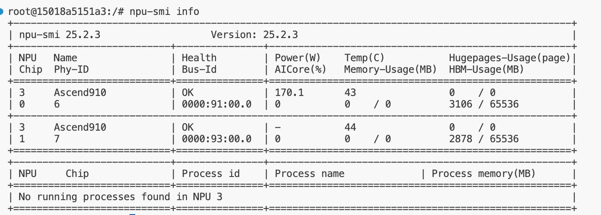
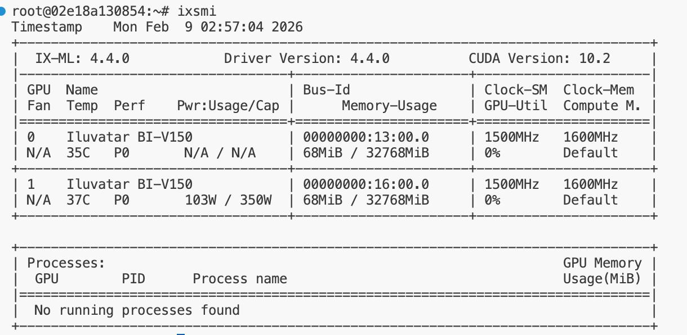
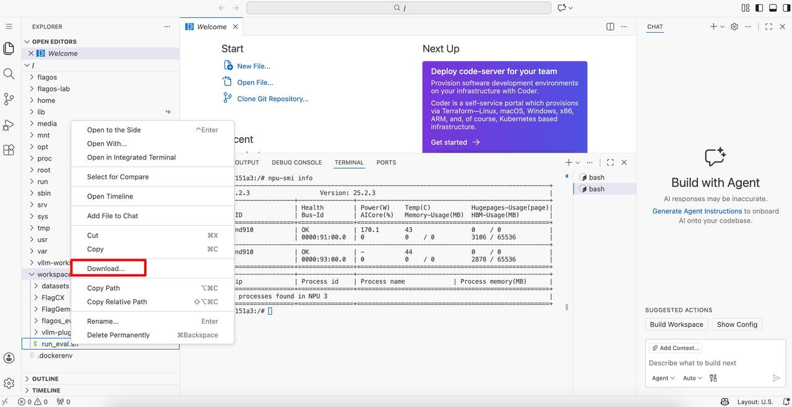

# Online laboratory user guide

1. After logging into Flag OS, click the **Online Laboratory** tab in the top-right corner.

2. View all unreleased environment containers, computing resource details, access endpoints, and other related information associated with your account.
   

3. In the **DevEnvironment Access** column, use one of the following methods to access the cloud-based online development environment:
    - **Option 1: Direct Access to the Development Environment**
      To access the environment directly, follow these steps:
      1. Navigate next to **Secret Key**, and click the Copy icon to copy the key.
      2. Click **Enter IDE**. When the Welcome dialog opens, paste the key and click **Submit**.
      
    - **Option 2: Access via Public Network**
      To access the development environment from a public network, follow these steps:
      1. You can map the service for the development environment to port 30000.
      2. Navigate under **Secret Key**, and click **More Access**.
      3. When the **More Access Information** dialog opens, click the **Service URL** link to open the environment.
      

4. Query the computing power configuration through terminal commands according to the card type.
    The card type is indicated in the resource information of the selected development environment mentioned in step 2.
    - For Iluvatar cards, use the command:

       ```{code-block} bash
       ixsm
       ```

      
    - For Huawei Ascend cards, use the command:

       ```{code-block} python
       npu-smi info
       ```

      

5. You can upload or download files such as code packages and models through the following methods:
     - Right-click your `Workspace` and select **Upload...**
      
     - Right-click your `Workspace` and select **Download...**
      

```{warning}
The experimental environment is a containerized environment. All data will be permanently deleted and unrecoverable upon release. Please back up your data locally.
```

For detailed usage instructions of Visual Studio Code, please refer to:<https://code.visualstudio.com/docs>.
